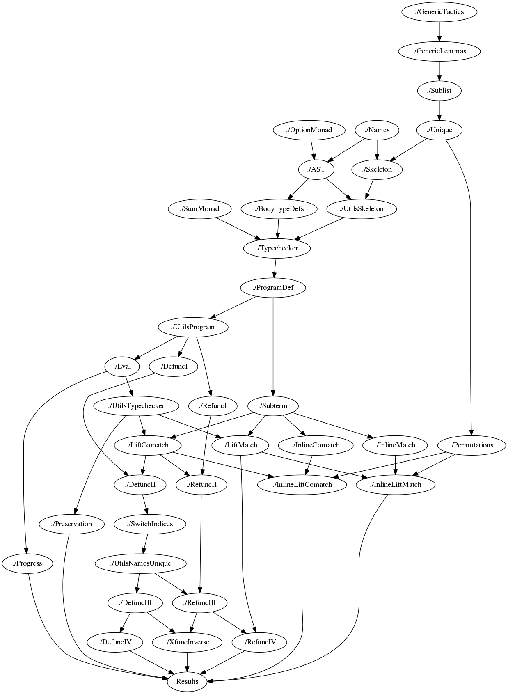

# Formalization of total Constructorization / Destructorization

## How to build

There are two ways to build the Coq formalization: either directly on your computer or inside a Docker container.

### Building locally

Building locally presupposes that you have a current version of Coq installed. We verified that the project builds with Coq 8.8.2.

The Makefile provides an `all` target which builds all parts relevant to the proofs.

```console
> make
coqdep -noglob InlineLiftComatch.v | head -n1 | sed 's/\s*[a-zA-Z]*\.v\.beautified//g' > InlineLiftComatch.d
...
coqdep -noglob UtilsSkeleton.v | head -n1 | sed 's/\s*[a-zA-Z]*\.v\.beautified//g' > UtilsSkeleton.d
coqc Names.v
...
coqc  Results.v
Closed under the global context
Closed under the global context
Closed under the global context
Closed under the global context
Closed under the global context
Axioms:
sort_cfuns_for_inline_permutes : forall p : program,
...
```

The `extract` target of the Makefile extracts Haskell source code to the `/haskell` subdirectory.

```console
> make extract
coqc  Extraction.v
Delete the old extracted files
Prepend necessary imports to .hs files.
Extracted Haskell Code and moved to subdirectory ./haskell
```

### Building using Docker

Alternatively, the formalization can also be built using Docker with the provided `Dockerfile`.
The Dockerfile builds the formalization and extracts the Haskell code. In order to get the files on your computer you have to copy them from a running container of the Docker image. The `build-with-docker.sh` shell script provides the necessary Docker incantations.

Example (with cached results):

```console
./build-with-docker.sh
Sending build context to Docker daemon  49.13MB
Step 1/7 : FROM coqorg/coq:8.8.2
 ---> 5af97f51b90b
Step 2/7 : COPY *.v                ./
 ---> Using cache
 ---> 5dcf0d348d59
Step 3/7 : COPY Makefile           .
 ---> Using cache
 ---> 39c6344ea17c
Step 4/7 : COPY prepend-imports.sh .
 ---> Using cache
 ---> 053f73d7d5c5
Step 5/7 : ENV PATH=$PATH:/home/coq/.opam/4.05.0/bin/
 ---> Using cache
 ---> f18977f52578
Step 6/7 : RUN ["make", "-j", "4", "all"]
 ---> Using cache
 ---> 2c8adbb45fd5
Step 7/7 : RUN ["make", "extract"]
 ---> Using cache
 ---> 0a5b0e7d75ab
Successfully built 0a5b0e7d75ab
Successfully tagged decomposition-diversity:latest
c4598339a5e54ed0e8cb0f27da5d2c21fc8ac35afc94953f60d3f03f42ea8ee2
decomposition-diversity-container
decomposition-diversity-container
```

## Dependencies



## Overview of the Formalization

The most important parts of the formalization are contained in the following files
and in the file `Results.v`, which explains how we validated the theorems stated in our paper.

### AST.v

Contains the definition of the abstract syntax of expressions.
Expressions are formalized with de Bruijn indices.
The file also contains:
- A custom induction principle for expressions. This is necessary since expressions are a nested inductive data type.
- Substitution of expressions for variables in expressions.

### Names.v

Contains definitions and lemmas about equality of names, qualified names and scoped names.

### Skeleton.v

Contains the definition of the `skeleton`, which is formalized as a dependent record.
The `skeleton` contains the datatypes and constructors, the codatatypes and destructors, and the signatures of all
functions, generator functions and consumer functions contained in the program.

```coq
Record skeleton : Type := mkSkeleton {
...
}
```

There are special fields in the dependent record which contain proofs that wellformededness conditions of the `skeleton` are
satisfied, e.g. that names of functions are unique.

### UtilsSkeleton.v

Contains functions for looking up information in a `skeleton`, such as looking up the constructors of a datatype.

### ProgramDef.v

Contains the definition of a program.

```coq
Record program : Type := mkProgram {
...
}.
```

A program is a `skeleton`, together with bodies for all signatures contained in the `skeleton`, and certain wellformedness conditions
(see `Results.v` for the role of these conditions).

### Typechecker.v

Contains both:

- A function `typecheck'` which given an expression `e`, a program `skeleton` `ps` and a typing context `ctx` returns a `(error + TypeName)`.
- An inductive relation `TypeDeriv` formalizing the typing rules for expressions.

```coq
Fixpoint typecheck (ps : skeleton) (ctx : ctxt) (e : expr) {struct e} : (error + TypeName)  :=
...

Inductive TypeDeriv : skeleton -> ctxt -> expr -> TypeName -> Prop :=
...coq
where "p '/' c '|-' e ':' t" := (TypeDeriv p c e t)
```

There is one theorem stating that the typecheck function is correct:

```coq
Theorem typecheck_correct : forall (prog : skeleton) (ctx : ctxt) (e : expr) (t : TypeName),
    typecheck prog ctx e = inr t ->
    prog / ctx |- e : t.
```

and one theorem stating that the typecheck function is complete:

```coq
Theorem typecheck_complete : forall (prog : skeleton) (ctx : ctxt) (e : expr) (tn : TypeName),
    prog / ctx |- e : tn ->
    typecheck prog ctx e = inr tn.
```

### Eval.v

Contains the definition of values both as a function and inductive relation:

```coq
Fixpoint value_b (e : expr) : bool :
...
Inductive value : expr -> Prop :=
...
Fixpoint value_reflect (e : expr) : reflect (value e) (value_b e).
...
```

Contains the definition of a single step evaluation function:

```coq
Fixpoint one_step_eval (p : program) (e : expr) {struct e} : option expr :=
```

together with an inductive relation:

```coq
Inductive step : program -> expr -> expr -> Prop :=
...
where "'[' prog '|-' e '==>' e' ']'" := (step prog e e') : eval_scope.
```

Together with proofs of the correctness and completeness of the inductive relation w.r.t to the
function:

```coq
Theorem eval_complete : forall (prog : program) (e1 e2 : expr),
    [ prog |- e1 ==> e2 ] ->
    one_step_eval prog e1 = Some e2.
	
Theorem eval_correct : forall (prog : program) (e e' : expr),
    one_step_eval prog e = Some e' ->
    [ prog |- e ==> e' ].
```

### Progress.v

Contains the proof of the progress property:

```coq
Theorem progress : forall (e : expr) (p : program) (tc : exists t, (program_skeleton p) / [] |- e : t),
    value_b e = true <-> one_step_eval p e = None.
```

### Preservation.v

Contains the proof of the preservation property:

```coq
Theorem preservation : forall (p : program) (e1 e2 : expr) (t : TypeName),
    ((program_skeleton p) / [] |- e1 : t) ->
    [ p |- e1 ==> e2 ] ->
    (program_skeleton p) / [] |- e2 : t.
```

### {D,C}torizeI.v to {D,C}torizeIV.v, Lift..., Inline...

For an overview of how the definitions and lemmas in these files are used to form our constructorization
and destructorization algorithms and prove their properties as stated in our paper, please refer to `Results.v`.

